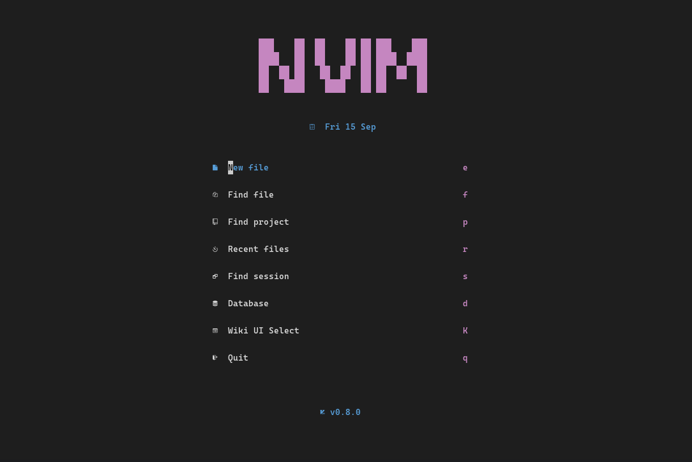

# Neovim Configuration
This repository contains my personal configuration for Neovim (nvim), a highly customizable text editor that I use for coding and text editing. 

## Acknowledgments
This configuration is based on the following repositories:

- [nvim-basic-ide](https://github.com/LunarVim/nvim-basic-ide) repository by [Christian Chiarulli](https://github.com/ChristianChiarulli). 
- [nvim](https://github.com/adalessa/nvim) repository by [Ariel](https://github.com/adalessa)
- [nvim-conIg](https://github.com/kohane27/nvim-config) repository by [kohane27](https://github.com/kohane27)

I'm grateful for their work and the foundation they provided for this configuration.
